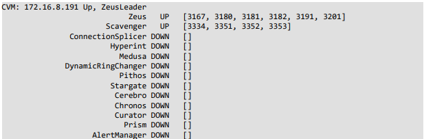

# Destroy Cluster

Destroying a cluster resets all nodes to the state they were in before the cluster was created. This process also destroys all guest VMs.

Cluster destruction is necessary if the customer wants to move from a single-node to a multi-node cluster, or if the customer is finished using Community Edition and wants to re-purpose the hardware for another application.

:::danger

Destroying a cluster also destroys all guest VMs. Ensure the customer has backed up any needed VMs or data because this process is irreversible!

:::

1. Connect to a CVM using SSH.
2. Stop the cluster by running the following command:

```
cluster stop
```

3. Wait until output like the following is displayed for every CVM:

_Figure 5: Cluster Stop Output_



Source: Nutanix. (2020). “Getting Started with Nutanix Community Edition”

4. Destroy the cluster using the following command:

```
cluster -f destroy
```
