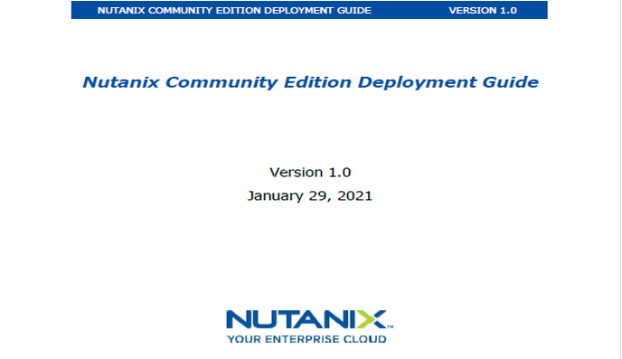

# Overview

A field installation guide for a fictitious Managed Services Provider (MSP) called RS Tech Services, this guide allows field engineers to perform initial deployments of Nutanix Community Edition at customer sites quickly and efficiently, necessitating fewer calls to senior technical personnel.

## Description

A field installation guide for a fictitious Managed Services Provider (MSP) called RS Tech Services, this guide allows field engineers to perform initial deployments of Nutanix Community Edition at customer sites quickly and efficiently, necessitating fewer calls to senior technical personnel. Nutanix is a software-defined hyper-converged platform which combines storage, computing, and virtualization. Community Edition is a free version of this platform intended for testing and non-production use cases.

## Problem

In this fictional scenario, RS Tech Services was receiving customer complaints regarding configuration errors made by field personnel during installation. It was also difficult and time-consuming to troubleshoot many of these issues because field techs were not creating as-built documentation. These issues were causing delays with customer projects.

## Solution

I created an end-to-end field installation guide that included a network info checklist that techs could use in as-built documentation.

## Impact

The guide enabled technicians to perform standardized deployments for customers while reducing human error. All system IPs, usernames, and passwords were documented for customers before leaving the site, and the result was a 40% decrease in installation-related support calls in the 90 days following publication.
