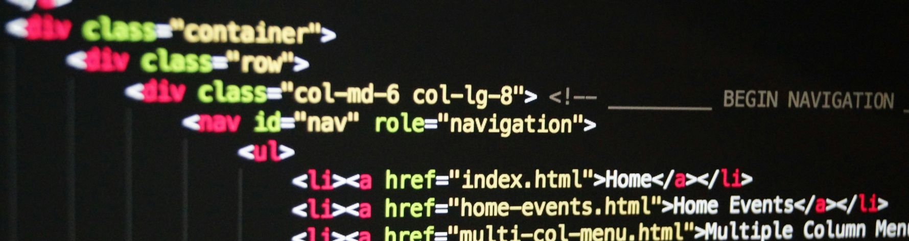

# HTML Cleaning Script

## Description

This is a short script written in Python that performs the following on HTML files:

- Removes:
  - `<head>` and all its content
  - `` (keeps content)
  - `<html>`
  - `<body>`
  - empty tags
  - all tag attributes (classes, etc.)
  - comments
  - trailing and leading spaces

I used the Beautiful Soup module to perform most of the operations. The script can be used to prepare raw HTML files for import into content management systems.

## Technologies Used

- Python
  - Beautiful Soup
  - re
  - argparse

  

<a href="https://github.com/rsteele6/html-cleaning-script" class="article-btn button small github" target="_blank">&nbsp;&nbsp;View code on GitHub</a>
